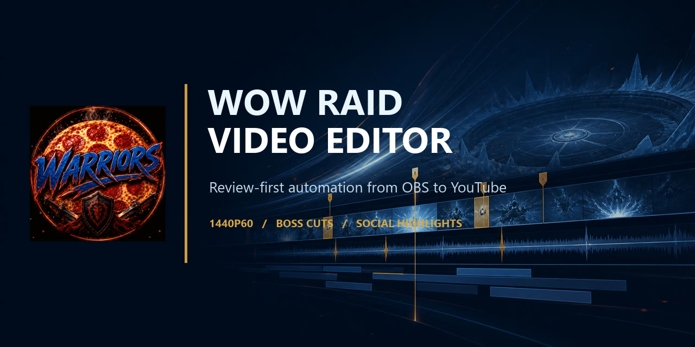

# WoW Raid Video Editor

[](https://github.com/CRSD-Lau/RaidVideoEditor/actions/workflows/ci.yml)
[](https://www.python.org/)
[](LICENSE)

Local-first, deterministic automation for turning a long OBS raid recording
into a polished full-clear movie and optional social highlights.

WoW Raid Video Editor is a local, review-first Python 3.12 CLI for turning one
long OBS raid recording into an approved full-clear movie and optional portrait
social clips. It verifies OBS before raid night, detects and labels winning boss
pulls, classifies ICC Normal/Heroic modes with auditable combat-log evidence,
and produces full-pull review media. A separate highlight lane fuses Discord
energy, game audio, motion changes, raid deaths, and kill climaxes into ranked
suggestions. Those suggestions are never approved automatically.

The full movie keeps game audio and excludes Discord and microphone tracks. The
separate highlight lane can explicitly mix game, Discord, and the creator's
microphone for reaction clips after all three stems are verified. Microphone
retention is off by default. The editor also generates scoreline-aware YouTube
metadata, three thumbnail candidates, playlist and analytics helpers, and a
copy-only hash-verified archive plan.

The application does **not** modify source media. Human review is required
before final rendering, portrait highlight rendering, playlist changes,
archiving, and any YouTube transmission. Uploads default to **Private**;
immediate public visibility requires a second, purpose-specific approval flag.

## Current workstation status

The following facts were checked by the read-only preflight on 2026-08-15:

- The active `WoW_Raid_1440p60` profile is configured for 2560x1440 at 60 fps,
  Hybrid MP4, and `D:\RaidRecordings` with more than 700 GiB free.
- Tracks 1 through 4 are labelled Full Mix, WoW Game, Discord, and Microphone.
  Source routing is isolated correctly: WoW uses tracks 1/2, Discord uses 1/3,
  and Mic/Aux uses 1/4.
- The active `WoW Raid` scene contains WoW, WebCam, and WebCam Border.
- The configured combat log existed but was stale. Start `/combatlog`, create a
  fresh event, and provide a fresh 10-second smoke recording before the next
  raid.
- The accumulated WoW 3.3.5 combat log is streamed only for the recording-time
  window instead of being loaded into memory.
- DaVinci Resolve 20.3.2 is installed as the apparent non-Studio edition. Its
  installed API documentation identifies the scripting API as a Resolve Studio
  feature. The installed shim works only through Python 3.13 on this host.
  Live API project creation/import has **not** been proven.
- The deterministic Resolve fallback is
  `timeline\timeline.fcpxml` plus
  `generated-assets\source-microphone-free.mov`. A manual import of the
  synthetic three-pull fixture succeeded in a new Resolve 20.3.2 project on
  2026-07-26.

See [OBS recording setup](docs/obs-recording-setup.md) before recording another
raid and [Resolve setup](docs/resolve-setup.md) before attempting an import.

## Requirements

- Windows 10 or 11
- Python 3.12 x64 for the main application
- [uv](https://docs.astral.sh/uv/)
- `ffmpeg` and `ffprobe` on `PATH`
- Optional Resolve API attempt: Python 3.13 x64 and Resolve Studio with local
  external scripting enabled

Install any missing main-runtime prerequisites with Windows Package Manager:

```powershell
winget install --id Python.Python.3.12 --exact
winget install --id astral-sh.uv --exact
winget install --id Gyan.FFmpeg --exact
```

Open a new PowerShell session after installation so `PATH` changes are visible.
Do not install or upgrade Resolve merely to run the CLI; FCPXML is the supported
fallback.

From PowerShell:

```powershell
Set-Location C:\Projects\RaidVideoEditor
py -3.12 --version
uv --version
ffmpeg -version
ffprobe -version
uv sync --python 3.12 --extra dev --frozen
uv run python --version
uv run raid-editor --help
```

`uv run python --version` should report Python 3.12. The Resolve bridge uses
`py -3.13` separately and does not change the main environment.

## First run with the synthetic fixture

The included fixture is safe for learning the workflow:

```powershell
uv run python scripts\generate-synthetic-fixture.py --force
uv run raid-editor inspect samples\synthetic-project.yaml --open-review
uv run raid-editor analyse samples\synthetic-project.yaml
uv run raid-editor review samples\synthetic-project.yaml
```

Inspect the audio samples and pull review. Only after accepting the stream map
and pull boundaries:

```powershell
uv run raid-editor build-timeline samples\synthetic-project.yaml
uv run raid-editor render-preview samples\synthetic-project.yaml
uv run raid-editor validate samples\synthetic-project.yaml
```

Generated fixture output is written beneath
`output\synthetic-pizza-warriors-raid\`.

## Start a real project

On Friday, run the read-only preflight after a fresh 10-second OBS recording:

```powershell
uv run raid-editor preflight config\my-raid.local.yaml `
  --smoke-recording 'D:\RaidRecordings\Friday smoke test.mp4'
```

The command checks the active profile and scene, 1440p60 geometry, disk space,
safe container, track labels and routing, combat-log freshness, and the actual
smoke file. It does not read OBS service credentials or stream keys.

The guided path is:

```powershell
uv run raid-editor wizard
```

The wizard selects a recording, shows the absolute FFprobe stream indexes, asks
for audio roles and a combat-log path, creates
`config\<project-slug>.local.yaml`, analyzes pulls, and opens the local review.
On the first pass, answer **No** when asked to render. The browser downloads
corrections but cannot write them into the YAML automatically.

For a deliberate command-by-command run:

```powershell
Copy-Item config\project.example.yaml config\my-raid.local.yaml
# Edit config\my-raid.local.yaml before continuing.
uv run raid-editor inspect config\my-raid.local.yaml --open-review
uv run raid-editor analyse config\my-raid.local.yaml
uv run raid-editor review config\my-raid.local.yaml
```

After the recording exists, the weekly shortcut prepares both independent
review gates without rendering or uploading anything:

```powershell
uv run raid-editor prepare-weekly config\my-raid.local.yaml
```

In the pull review:

1. Listen and watch enough source evidence to confirm the mapping.
2. Correct include flags, titles, start/end seconds, and notes.
3. Download `pull-overrides.json`.
4. Move it to a stable local path and set `input.manual_pulls` to that path.
5. Rerun `analyse` and `review`; verify the corrected version.

Then cross the explicit preview gate:

```powershell
uv run raid-editor build-timeline config\my-raid.local.yaml
uv run raid-editor render-preview config\my-raid.local.yaml
uv run raid-editor validate config\my-raid.local.yaml
```

Watch the complete preview and read the reports before manually importing the
FCPXML into Resolve. Preview creation remains an operator review boundary; final
rendering adds a machine-enforced approval flag and records it in the manifest.

The highlight review is separate from the full movie. Download the reviewed
`highlight-overrides.json`, set `highlights.manual_selection`, then render only
the rows explicitly marked `include: true`:

```powershell
uv run raid-editor analyse-highlights config\my-raid.local.yaml --open
uv run raid-editor render-highlights config\my-raid.local.yaml --approved
```

Portrait exports follow the explicit highlight audio policy. Set
`highlights.keep_microphone_audio: true` to retain the separately verified mic
alongside game and Discord reactions. They are posting packages only; no TikTok
or Shorts upload occurs.

After watching and approving the complete preview, create the local final master:

```powershell
uv run raid-editor render-final config\my-raid.local.yaml --approved
```

This command records approval in the final manifest, renders to `final\`, validates
the output, and performs no upload or publishing action.

Prepare and inspect the YouTube package without transmitting the video:

```powershell
uv run raid-editor upload-youtube config\my-raid.local.yaml --dry-run
```

Review `youtube\metadata.json`, `description.md`, `chapters.txt`,
`thumbnail-source.jpg`, `studio-details.md`, and `upload-checklist.md`. For a
Public post from an unverified API project, use those exact files in YouTube
Studio. If Studio has no separate game-rating control, leave it unset rather
than substituting another rating. For a Private API upload, start the upload
with:

```powershell
uv run raid-editor upload-youtube config\my-raid.local.yaml --approved
```

The first approved run opens Google's OAuth consent page in the default browser.
The OAuth client JSON and resulting token remain under the ignored local
`secrets\` directory. The command computes the full final-master SHA-256,
retries transient upload failures, applies the generated thumbnail when the
channel permits custom thumbnails, records the returned video ID, and will not
re-upload an identical master/metadata pair. See the [YouTube upload
workflow](docs/youtube-upload.md).

After publication, playlist management and analytics remain explicit commands:

```powershell
uv run raid-editor confirm-youtube-publication config\my-raid.local.yaml `
  --video-id VIDEO_ID --maximum-quality 1440p60 --approved
uv run raid-editor sync-playlist config\my-raid.local.yaml `
  --video-id VIDEO_ID --approved
uv run raid-editor youtube-analytics config\my-raid.local.yaml `
  --video-id VIDEO_ID --label 48h
uv run raid-editor youtube-analytics config\my-raid.local.yaml `
  --video-id VIDEO_ID --label 7d
```

When public playback and 1440p processing have been verified, inspect the
copy-only plan before approving an archive:

```powershell
uv run raid-editor archive-plan config\my-raid.local.yaml
uv run raid-editor archive config\my-raid.local.yaml --approved
```

## Commands

| Command | What it does |
| --- | --- |
| `preflight CONFIG [--smoke-recording FILE]` | Read-only Friday check of OBS profile/scene, 1440p60, disk, tracks, combat log, and an optional real test file. |
| `inspect TARGET` | Probes a YAML project or recording and optionally creates audio samples. |
| `analyse CONFIG` | Detects pulls, classifies supported ICC difficulty evidence, and writes reports plus configurable sample or full-pull review clips. |
| `review CONFIG` | Regenerates and opens the local pull review. |
| `analyse-highlights CONFIG` | Ranks funny, reaction, movement, clutch, and intense moments; all candidates default to unapproved. |
| `prepare-weekly CONFIG` | Prepares and optionally opens both boss and highlight review gates without a final render or upload. |
| `build-timeline CONFIG` | Writes timeline JSON, SRT labels, chapters, FCPXML, Resolve payload, and the microphone-free MOV sidecar. |
| `create-resolve-project CONFIG` | Attempts unique-project creation through the Python 3.13 Resolve bridge. Use `--dry-run` first. |
| `render-preview CONFIG` | Renders only the configured review MP4. Use `--dry-run` to prepare artifacts without starting the MP4 render. |
| `render-final CONFIG --approved` | Renders and validates the approved local master. The approval flag is mandatory; no upload occurs. |
| `render-highlights CONFIG --approved` | Renders only selected portrait clips with the configured game, Discord, and optional microphone mix. |
| `upload-youtube CONFIG --dry-run` | Generates scoreline titles, difficulty chapters, three thumbnails, description, and checklists without authentication or transmission. |
| `upload-youtube CONFIG --approved` | Hashes and resumably uploads the validated master. Visibility defaults to Private. Public API uploads require `--public-approved` and a verified API project; otherwise use Studio. |
| `confirm-youtube-publication CONFIG --video-id ID --approved` | Records an operator-confirmed public watch page and 1440p/1440p60 result for the archive gate; performs no remote verification. |
| `sync-playlist CONFIG --video-id ID --approved` | Idempotently creates/finds the configured weekly playlist and adds the approved video. |
| `youtube-analytics CONFIG --video-id ID` | Writes read-only summary and audience-retention reports; Studio-only impressions/CTR can be supplied manually. |
| `archive-plan CONFIG` | Lists every proposed archive copy without hashing, copying, moving, or deleting. |
| `archive CONFIG --approved` | Copies and SHA-256 verifies the approved archive; no source deletion command exists. |
| `validate CONFIG` | Rebuilds required artifacts, checks source metadata, pull bounds, microphone-stream count, and preview readability. |
| `wizard [CONFIG]` | Runs the guided setup or reopens the guided review for an existing project. |

Add `--verbose` before the command for diagnostic logging:

```powershell
uv run raid-editor --verbose analyse config\my-raid.local.yaml
```

`--dry-run` is not zero-write: timeline, sidecar, reports, payload, filter files,
and/or a YouTube review package may still be prepared. It prevents the Resolve
bridge call, media render, authentication, or network transmission for the
corresponding command.

## Configuration essentials

Paths in YAML are resolved relative to that YAML file. Use forward slashes or
single-quoted Windows paths. Unknown keys are rejected.

```yaml
project:
  name: "Pizza Warriors Raid"
  game: "World of Warcraft"
  expansion: "Wrath of the Lich King"
  raid: "Icecrown Citadel"
  raid_date: 2026-07-26

input:
  recording: 'D:\Raid Videos\2026-07-26 20-00-00.mov'
  combat_log: 'D:\world of warcraft 3.3.5a hd\Logs\WoWCombatLog.txt'
  details_export: null
  skada_export: null
  manual_pulls: null

audio:
  microphone_track: 4
  game_track: 2
  discord_track: 3
  mixed_track: 1
  keep_game_audio: true
  keep_discord_audio: false
  remove_microphone: true

detection:
  minimum_pull_seconds: 15
  merge_gap_seconds: 8
  pre_roll_seconds: 5
  post_roll_seconds: 8
  confidence_threshold: 0.70
  combat_log_offset_seconds: 0
  recording_started_at: "2026-07-26T20:00:00-03:00"

difficulty:
  enabled: true
  raid_size: null
  expected_bosses: 12
  title_raid_abbreviation: "ICC"
  require_confirmed_for_auto_title: true

highlights:
  enabled: true
  manual_selection: null
  maximum_candidates: 12
  minimum_score: 0.30
  keep_game_audio: true
  keep_discord_audio: true
  keep_microphone_audio: false
  motion_keyframes_only: true
  vertical_resolution: "1080x1920"

preflight:
  enabled: true
  obs_profile_dir: "WoW_Raid_1440p60"
  obs_scene_collection_file: "WoW_Raid_Recording.json"
  expected_scene: "WoW Raid"
  expected_resolution: "2560x1440"
  expected_fps: 60
  minimum_free_space_gib: 150
  smoke_recording_max_age_minutes: 30

editing:
  include_trash_pulls: true
  include_boss_wipes: true
  include_boss_kills: true
  include_run_backs: false
  include_loot: true
  transition_duration_seconds: 0.4

music:
  library: "../music/music-library.json"
  approved_track_ids: []

preview:
  resolution: "1280x720"
  fps: 30
  bitrate: "4M"
  hardware_encoding: false

final:
  resolution: "source"
  fps: "source"
  codec: "h264"
  hardware_encoding: true
  constant_qp: 18
  preset: "p6"
  audio_bitrate: "320k"

youtube:
  enabled: false
  client_secrets: "../secrets/youtube-client.local.json"
  token: "../secrets/youtube-token.local.json"
  management_token: "../secrets/youtube-token-management.local.json"
  analytics_token: "../secrets/youtube-token-analytics.local.json"
  privacy_status: "private"
  category_id: "20"
  category_name: "Gaming"
  game_title: "World of Warcraft"
  game_rating: "Unrated"
  title: null
  description: null
  tags: []
  hashtags: ["#WorldOfWarcraft", "#WotLK", "#IcecrownCitadel"]
  default_language: "en"
  made_for_kids: false
  age_restricted: false
  contains_synthetic_media: false
  license: "youtube"
  allow_embedding: true
  notify_subscribers: true
  api_project_verified_for_public: false
  forbid_em_dash: true
  chunk_size_mib: 16
  thumbnail_variants: 3
  selected_thumbnail_variant: 1
  playlist_auto_add: true
  playlist_id: null
  playlist_title: "Pizza Warriors Weekly ICC Clears"
  playlist_privacy_status: "public"
  analytics_enabled: true

archive:
  enabled: false
  destination: null
  include_raw_recording: true
  include_final_master: true
  include_project_artifacts: true
  require_public_1440p_verified: true
```

Audio numbers are absolute FFprobe stream indexes, not OBS track labels or
zero-based audio ordinals. Always copy them from `inspect`. The full movie still
requires a microphone-free retained program stream, and `mixed_track` is not
used when `remove_microphone: true`. Highlight review has a separate, explicit
`keep_microphone_audio` policy and mixes the selected stems into one output track.

`manual_pulls`, when set, becomes authoritative and bypasses combat-log and
Skada detection. Otherwise the detector prefers explicit combat-boundary events.
For legacy 3.3.5 logs with no boundary events, it deterministically clusters
damage activity as lower-confidence `unknown` pulls. An optional
`skada_export` can add timestamped boss segments and outcomes without executing
the Lua file. These fallbacks still require manual review.

The `final` section controls the explicitly approved local master. With hardware
encoding enabled, H.264 NVENC uses constant-QP quality; the default QP 18 is a
high-quality archival/upload master. The preview and final commands share the
same deterministic timeline, titles, watermark, presentation cards, and audio map.

Set `youtube.enabled: true` only after creating a Google OAuth **Desktop app**
client. Keep `privacy_status: private` for API uploads unless the Google project
has completed YouTube's required audit. Public API uploads require both
`api_project_verified_for_public: true` and `--public-approved`; otherwise the
generated checklist routes the Public post through YouTube Studio.

## Generated output

Each project writes to `output\<slug-from-project-name>\`:

```text
analysis\          media probe, pull candidates, parser issues
review\            local HTML, audio samples, thumbnails, sample or full-pull clips
highlights\         ranked candidates, full review clips, approved portrait exports
timeline\          timeline.json, timeline.fcpxml, pull-labels.srt
generated-assets\  source-microphone-free.mov and its manifest
preview\           review MP4, FFmpeg filter script, manifest
final\             approved local master, FFmpeg filter script, manifest
youtube\           title, description, chapters, thumbnail tests, playlist and upload plans
analytics\         read-only 48-hour and 7-day YouTube performance reports
archive\           copy-only plan; approved archive files go to the configured destination
reports\           difficulty, highlights, chapters, audio, edit, validation, upload status
resolve\           create-project.json bridge payload
```

The source recording, combat log, Skada file, and music files are read-only
inputs. There is no `clean` command. To remove generated data safely, close
browsers and Resolve, verify the exact project folder under `output`, and remove
only that folder. See [Security and privacy](docs/security-and-privacy.md) for a
guarded PowerShell example and the list of files that live outside `output`.

## Documentation

- [Documentation index](docs/README.md)
- [Architecture and safety boundaries](docs/architecture.md)
- [OBS recording setup](docs/obs-recording-setup.md)
- [Combat-log and Skada setup](docs/combat-log-setup.md)
- [Music licensing workflow](docs/music-licensing.md)
- [YouTube upload workflow](docs/youtube-upload.md)
- [Resolve setup and deterministic fallback](docs/resolve-setup.md)
- [Resolve computer-use runbook](docs/resolve-computer-use-runbook.md)
- [Troubleshooting](docs/troubleshooting.md)
- [Security, privacy, and generated-file removal](docs/security-and-privacy.md)
- [Contributing](CONTRIBUTING.md)
- [Security policy](SECURITY.md)
- [Changelog](CHANGELOG.md)

## Explicit MVP limitations

- One recording per project; no multi-file stitching.
- The current portrait source is fitted and padded, not automatically cropped,
  rotated, or reframed.
- Microphone removal is track exclusion, not voice separation. A dedicated mic
  track and at least one microphone-free program track are mandatory for the
  full movie. Highlight clips may opt into that verified mic stem separately.
- Pull detection is evidence-based, not gameplay understanding. Damage-activity
  clusters are lower-confidence and unclassified; Skada evidence can still be
  misaligned.
- Highlight detection ranks signals rather than understanding humor. Every
  candidate defaults to excluded and requires full-clip review.

Difficulty labels are per winning pull. Supported, unambiguous boss-specific
spell evidence wins; conflicting or missing evidence remains `UNKNOWN` and can
block the automatic heroic scoreline. The title format is
`ICC 25M 12/12 7HC Full Clear` for a fully confirmed example, never a guessed
Heroic count.

- Highlight detection is heuristic proposal generation, not content
  understanding. Audio energy, motion, combat pressure, and boss kills may
  produce false positives or miss a good joke. Review the full candidate clips
  and opt in to each export. The default visual pass samples keyframes so a
  multi-hour Friday recording stays practical; set
  `motion_keyframes_only: false` for a slower, denser scan when visual motion
  matters more than runtime.
- The browser review downloads files but does not apply them.
- Only the first approved music ID is mixed into the preview. Music is not added
  to FCPXML or the Resolve project.
- The preview is not a final master; final rendering requires `--approved`.
- Synthetic H.264 FCPXML/Resolve import is proven on this host. Import of the
  current real MOV/HEVC sidecar remains unproven.
- The Resolve API bridge may require Resolve Studio. It refuses to modify an
  existing project and contains no render-job, final-render, upload, or
  publishing code; YouTube support is a separate guarded module.
- Validation is useful but bounded: source safety compares size and nanosecond
  modification time with the probe, and the fingerprint hashes only bounded
  head/tail chunks rather than the entire recording.
- YouTube upload is supported only for an already validated final master and
  requires a separate approval. No command deletes source material or silently
  changes an uploaded video's visibility.
- Playlist changes and archive copies each require their own approval. Analytics
  are read-only; thumbnail impressions and click-through rate must currently be
  copied from Studio into the report command.
