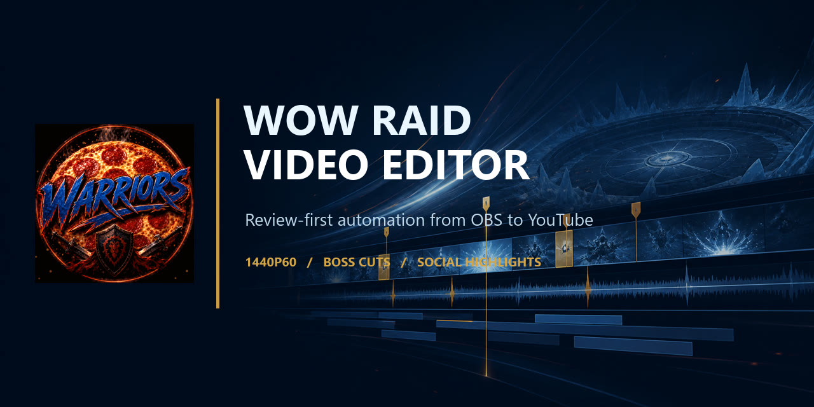

# WoW Raid Video Editor

[](https://github.com/CRSD-Lau/RaidVideoEditor/actions/workflows/ci.yml)
[](https://www.python.org/)
[](LICENSE)

Turn a long World of Warcraft raid recording into a reviewed raid movie and a
small set of worthwhile social clips. The editor runs locally on Windows, keeps
editorial decisions inspectable, and requires explicit approval before final
media renders or publication.

Built for the Pizza Warriors weekly ICC workflow, it combines Python, FFmpeg,
combat-log evidence, optional local speech/vision models, and browser review
pages. General projects can use their own recordings, audio mapping, and cuts;
the `friday` shortcut applies the guild's specific 1440p60 recording and
presentation defaults.

[Get started](#get-started) · [Weekly workflow](#run-a-raid) ·
[Local intelligence](docs/highlight-intelligence.md) ·
[Documentation](docs/README.md) · [Changelog](CHANGELOG.md)

## What it does

| Stage | Result | Review boundary |
| --- | --- | --- |
| Capture checks | OBS profile/scene, labelled audio stems, disk space, fresh combat evidence, and landscape/portrait smoke checks | Re-probe and listen to each recording; labels alone cannot prove isolation |
| Raid edit | Winning boss pulls, ICC Normal/Heroic evidence, full-pull previews, chapters, scorelines, and a styled raid movie | Review cuts, unresolved difficulty, and the complete movie preview |
| Highlight discovery | Corrected gameplay signals, exact spoken `clip it` requests, and optional local semantic/visual suggestions | Recommendations are advisory and may be empty |
| Highlight review | Full-context WebM players, editable boundaries, explicit ratings, and separate export checkboxes | A positive rating is feedback; it does not approve an export |
| Native portrait media | Original Aitum composition synchronized to landscape audio, with verified full-window coverage | Approval binds the reviewed source pair, timing, and audio mix |
| YouTube package | Titles, chapters, three thumbnails, description, resumable API upload, playlist and analytics helpers | Upload, Public visibility, and playlist changes have separate gates |
| Social and growth | Facebook/Instagram/TikTok/Twitch packages, source lineage, claims, related-video receipts, locked calendars, experiments, analytics, and cleanup holds | Local planning and observed receipts do not publish posts or change platform schedules |

The weekly movie keeps game audio and excludes Discord and the microphone.
Weekly highlights retain the separately verified game, Discord, and microphone
stems. Generic configurations control this policy explicitly; microphone
retention is off by default. Voice separation from a mixed track is not provided.

## Get started

Use a source checkout on Windows 10 or 11 with:

- **Python 3.12 or newer**, compatible with the locked dependencies.
- [uv](https://docs.astral.sh/uv/).
- `ffmpeg` and `ffprobe` on `PATH`. Browser review needs VP9/Opus support; final
  upload masters use H.264/AAC.

For a fresh installation, Python 3.12 is a supported choice. Preserve an
existing compatible project interpreter; installing optional models does not
require replacing it. Resolve is optional and has its own
[setup and compatibility limits](docs/resolve-setup.md).

```powershell
git clone https://github.com/CRSD-Lau/RaidVideoEditor.git
Set-Location RaidVideoEditor
uv sync --frozen
uv run --no-sync python --version
ffmpeg -version
ffprobe -version
uv run --no-sync raid-editor --help
```

Start with synthetic media, without credentials, models, or raid recordings:

```powershell
uv run --no-sync python scripts\generate-synthetic-fixture.py --force
uv run --no-sync raid-editor inspect samples\synthetic-project.yaml --open-review
uv run --no-sync raid-editor analyse samples\synthetic-project.yaml
uv run --no-sync raid-editor review samples\synthetic-project.yaml
```

After checking the synthetic audio mapping and proposed cuts:

```powershell
uv run --no-sync raid-editor render-preview samples\synthetic-project.yaml
uv run --no-sync raid-editor validate samples\synthetic-project.yaml
```

Outputs are written beneath `output/synthetic-pizza-warriors-raid/`. The fixture
uses landscape mode and does not require an Aitum companion. See
[CONTRIBUTING](CONTRIBUTING.md) for development, packaging, and media checks.

### Optional local highlight intelligence

The base editor works without downloaded models. To add local editorial
analysis:

```powershell
uv sync --extra speech --extra intelligence --frozen
uv run --no-sync python scripts\setup-highlight-intelligence.py
```

Explicit setup downloads a pinned portable Ollama runtime, a pinned
faster-whisper English model, and the configured local editorial/vision model
(default `qwen3.5:9b`). The separate exact-command recognizer also needs the
[Vosk model setup](docs/spoken-highlight-triggers.md). GPU speech support is an
optional extra; it is not required for the base editor or native video sync.

Inference stays local. The managed server uses `127.0.0.1:11435`; no Windows
service, startup item, or global environment change is installed. Normal
analysis does not download models. Transcripts, decoded inference audio,
inference frames, and free-form model responses are not retained in results.
Model assets have [separate licenses](THIRD_PARTY_NOTICES.md).

Read the [intelligence guide](docs/highlight-intelligence.md) for setup paths,
GPU/CPU behavior, complete versus degraded coverage, explicit feedback,
boundary review, and blinded comparison. Small successful fixtures do not prove
full-raid recall or improved human acceptance.

## Run a raid

For a general recording, `uv run --no-sync raid-editor wizard` guides project
setup. You can also copy [the example YAML](config/project.example.yaml) to an
ignored `config/my-raid.local.yaml` and set its paths and stream indexes.
Paths resolve relative to the YAML file; unknown keys are rejected. Audio
indexes are absolute FFprobe stream indexes, not audio-track ordinals.

For the Pizza Warriors dual-recording workflow, follow
[OBS recording setup](docs/obs-recording-setup.md), then run the read-only
preflight against actual smoke files:

```powershell
uv run --no-sync raid-editor preflight config\my-raid.local.yaml `
  --smoke-recording 'D:\RaidRecordings\Friday smoke test.mp4' `
  --vertical-smoke-recording 'D:\RaidRecordings\Vertical\Friday smoke test.mp4'
```

These are example paths. After capture has stopped, the weekly shortcut accepts
an explicit landscape recording or a recording directory:

```powershell
uv run --no-sync raid-editor friday --recording 'D:\RaidRecordings\2026-09-11 22-00-00.mp4'
# Or discover the newest completed non-smoke file directly in this directory:
uv run --no-sync raid-editor friday --recording-directory 'D:\RaidRecordings'
```

`friday` verifies landscape 2560x1440 at 60 fps and distinct labelled Full Mix,
game, Discord, and microphone stems. It creates or safely reuses a dated config,
prepares the boss/highlight review lanes, and creates local campaign evidence.
It stops before final rendering or upload. `--config-only` stops after config
creation; an existing dated config is not overwritten.

### Native portrait defaults

New weekly configs use `highlights.video_source: native_vertical` and discover a
unique companion in the configured `Vertical` subdirectory. They clear any
previous week's companion path and offset hint. Older configs that omit this
field retain `landscape` mode; existing approvals are not silently migrated.
The example YAML explicitly requests native mode, so bind its companion or
choose landscape mode deliberately before highlight media generation.

Native highlights preserve the original Aitum composition without added blur
or title overlays. Analysis, candidate timestamps, and retained audio stay on
the landscape clock. Shared audio at separated points must establish a single
consistent offset, and the entire proposed clip must exist in both files.
A filename match or configured timing hint cannot bypass this verification.

Missing, ambiguous, drifting, or incomplete portrait coverage blocks native
highlight media without falling back silently. The landscape archive can still
be prepared independently. See the
[native recording contract](docs/highlight-intelligence.md#use-the-recorded-portrait-composition).

### Review, then export

Use `input.manual_pulls` for reviewed pull overrides and
`highlights.manual_selection` for reviewed highlight overrides. Feedback imports
are separate from applying an override. There is no quota: zero selected Shorts
is valid, and the weekly growth workflow accepts up to two strong choices.

```powershell
uv run --no-sync raid-editor analyse-highlights config\my-raid.local.yaml --open
uv run --no-sync raid-editor import-highlight-feedback path\highlight-overrides.json
uv run --no-sync raid-editor compare-highlights config\my-raid.local.yaml --open
```

Watch complete setup and payoff, adjust timing when necessary, and explicitly
select exports. Source or presentation changes require reviewing the new media.
Once the relevant cuts and full preview have been accepted:

```powershell
uv run --no-sync raid-editor render-final config\my-raid.local.yaml --approved
uv run --no-sync raid-editor render-highlights config\my-raid.local.yaml --approved
uv run --no-sync raid-editor upload-youtube config\my-raid.local.yaml --dry-run
```

These are separate lanes: a movie approval does not approve Shorts, and a local
render does not publish anything. Generic YouTube visibility defaults to
Private; weekly templates can configure Public, which still requires separate
public-upload approval and verified API eligibility. Follow the
[YouTube guide](docs/youtube-upload.md) before transmitting media.

## Publishing, evidence, and retention

`prepare-social` validates approved portrait masters and builds four-platform
copy, reviews, release plans, publication receipts, and analytics inputs.
`prepare-growth` joins these with the raid archive, source lineage, factual
claims, related-video targets, locked schedules, and cleanup dependencies.
These commands prepare local state; they do not automate Facebook, Instagram,
TikTok, or Twitch publication. Twitch packages target Video Producer Uploads.

Use [social publishing](docs/social-publishing.md) and
[growth workflow](docs/growth-workflow.md) for the command sequence and observed
receipt requirements. A local approval or schedule is not evidence of a public
post. YouTube upload and playlist helpers use the official API with separately
configured OAuth files.

`archive-plan` prepares a copy plan; `archive --approved` copies and verifies
hashes without deleting its sources. Operational cleanup is a separate,
explicitly approved action, subject to publication and dependency holds. Keep
recordings needed for review/comparison and retain small social masters until
their required destinations are verified or explicitly waived. See
[security and privacy](docs/security-and-privacy.md).

## Project layout

| Path | Purpose |
| --- | --- |
| `src/raid_editor/` | CLI, config, ingestion, detection, review, rendering, intelligence, social and growth modules |
| `config/project.example.yaml` | Documented configuration starting point |
| `samples/`, `scripts/` | Synthetic fixtures, explicit local-model setup, and reproducible checks |
| `assets/` | Presentation artwork and optional OBS browser/controller assets |
| `docs/` | Operational guides, architecture, decisions, and historical evidence |
| `tests/` | Unit and synthetic integration coverage |
| `output/`, `.models/`, `.tools/` | Local generated media, model weights, and portable tools; excluded from Git |

Run `uv run --no-sync raid-editor COMMAND --help` for options. The
[architecture command map](docs/architecture.md#3-runtime-and-command-surface) and
[documentation index](docs/README.md) cover the larger workflow.

## Limits and evidence

- One landscape master and one optional synchronized portrait companion; no
  multi-file stitching or piecewise drift repair.
- Combat evidence and model judgments are provisional. Conflicting boss
  difficulty remains unresolved, and heuristic volume/motion does not prove a
  funny or exceptional moment.
- Native synchronization and output geometry have synthetic checks; a real
  session still needs picture, timing, crop, and audio review at separated points.
- Stream exclusion cannot remove a voice already mixed into a retained stem.
- Source cache identity uses bounded fingerprints; these are not full-file
  cryptographic proof. Final/archive checks use full hashes where documented.
- Browser-facing pull/highlight reviews use VP9/Opus WebM. The assembled movie
  preview remains a separate MP4 render; verify playback in the chosen viewer.
- Resolve API integration depends on the installed edition and Python bridge.
  FCPXML/manual import remains the documented fallback.
- Historic workstation and benchmark reports describe their dated fixtures,
  not the reader's machine or a current performance guarantee.

The project is MIT-licensed; artwork, music, models, and optional vendor
binaries retain their own terms. Read [third-party notices](THIRD_PARTY_NOTICES.md),
[contribution guidance](CONTRIBUTING.md), and [the security policy](SECURITY.md).
