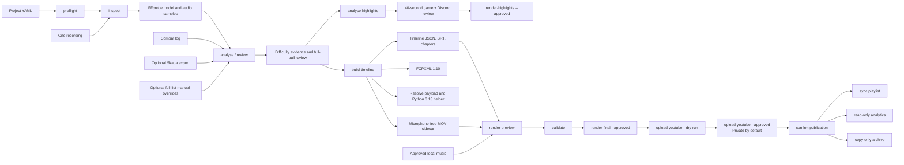

# Raid Video Editor architecture

**Status:** implemented review-first workflow, reconciled with source and tests on 2026-08-15
**Runtime:** Windows, CPython 3.12, local command-line workflow  
**Entry point:** `raid-editor`

## 1. Scope

Raid Video Editor condenses one local World of Warcraft raid recording into a
reviewed full-clear movie and optional portrait highlights. It verifies OBS,
inspects media, makes audio tracks reviewable, excludes a separately recorded
microphone stream, derives pull candidates from local combat evidence, labels
ICC Normal/Heroic modes, proposes noteworthy social moments, builds a neutral
timeline, exports FCPXML and a Resolve bridge payload, renders review media, and
can render and upload an explicitly approved final master.

The implementation is review-first rather than autonomous. It does not understand gameplay or remove speech from a mixed track. Final rendering and YouTube transmission are separate approval-gated stages; uploads default to Private and Public requires an additional approval.

## 2. Implemented workflow



The normal operator sequence is:

```powershell
uv run raid-editor inspect config\my-raid.local.yaml --open-review
uv run raid-editor analyse config\my-raid.local.yaml
uv run raid-editor review config\my-raid.local.yaml
# Save the downloaded pull-overrides.json and reference it from input.manual_pulls.
uv run raid-editor analyse-highlights config\my-raid.local.yaml --open
uv run raid-editor build-timeline config\my-raid.local.yaml
uv run raid-editor render-preview config\my-raid.local.yaml
uv run raid-editor validate config\my-raid.local.yaml
uv run raid-editor render-final config\my-raid.local.yaml --approved
uv run raid-editor upload-youtube config\my-raid.local.yaml --dry-run
# Review the generated YouTube package before the separately approved upload.
uv run raid-editor upload-youtube config\my-raid.local.yaml --approved
```

`wizard` offers a guided route through the same stages. It does not add a stronger approval or persistence mechanism.

## 3. Runtime and command surface

The main package is `raid_editor`. Typer defines the CLI, Pydantic validates serialized models and YAML configuration, and PyYAML uses `safe_load`. FFmpeg and FFprobe are external dependencies found on `PATH`.

The implemented commands are:

| Command | Implemented responsibility |
|---|---|
| `inspect TARGET` | Probe a YAML project or an ad hoc recording; optionally create audio samples and an audio-role page. |
| `analyse CONFIG` | Detect or load pulls; write JSON, CSV, issues, uncertainty reports, thumbnails, clips, and review HTML. |
| `review CONFIG` | Rebuild and optionally open the pull-review page. |
| `analyse-highlights CONFIG` | Fuse motion, game/Discord energy, combat pressure, and boss climaxes into unapproved review candidates. |
| `render-highlights CONFIG --approved` | Render only explicitly selected portrait clips with game/Discord audio and hard microphone exclusion. |
| `prepare-weekly CONFIG` | Prepare both review gates without rendering a final or transmitting anything. |
| `build-timeline CONFIG` | Build timeline artifacts, microphone-free sidecar, FCPXML, and Resolve payload. |
| `create-resolve-project CONFIG` | Invoke the isolated Python 3.13 Resolve helper; supports `--dry-run`. |
| `render-preview CONFIG` | Build dependencies and render the configured review MP4; supports `--dry-run`. |
| `render-final CONFIG --approved` | Render and validate the accepted high-quality local master; never uploads it. |
| `upload-youtube CONFIG --dry-run` | Generate reviewable upload metadata, chapters, and thumbnail with no authentication or transmission. |
| `upload-youtube CONFIG --approved` | Full-hash and resumably upload the validated master, Private by default. Public also requires `--public-approved`. |
| `validate CONFIG` | Rebuild required artifacts and run the bounded validation checks. |
| `preflight CONFIG` | Read-only OBS profile, scene, track-routing, disk, combat-log, and smoke-recording checks. |
| `confirm-youtube-publication CONFIG --approved` | Record operator-confirmed public 1440p playback evidence and hashes. |
| `sync-playlist CONFIG --approved` | Idempotently create/find the configured playlist and add the approved video. |
| `youtube-analytics CONFIG` | Write read-only summary and retention reports for the approved video. |
| `archive-plan CONFIG` | Enumerate the copy-only archive set without hashing or copying. |
| `archive CONFIG --approved` | Copy to a separate destination and verify every file with SHA-256; never delete source data. |
| `wizard [CONFIG]` | Create a local YAML interactively or reopen an existing guided workflow. |

There are no `init`, `doctor`, `audio`, `sync`, `pulls`, `music`, `status`, lock-recovery, or standalone export commands.

Operational errors handled by a command normally exit with code 2. `validate` exits with code 1 when its checks complete but do not pass.

## 4. Project configuration and output

One YAML file describes one source recording. Relative paths are resolved against the YAML file’s directory. Unknown keys are rejected.

The durable configuration sections are:

- `project`: display metadata.
- `input`: recording, combat log, optional Details placeholder, optional Skada export, and optional manual-pull file.
- `audio`: absolute FFprobe stream indexes and keep/remove choices.
- `detection`: minimum duration, merge gap, handles, confidence threshold, one combat-log offset, and optional recording start.
- `editing`: inclusion policies and transition duration.
- `music`: registry path and explicitly approved IDs.
- `preview`: resolution, frame rate, bitrate, hardware choice, watermark, and presentation cards.
- `final`: source/explicit geometry and frame rate, codec, quality, preset, hardware choice, and audio bitrate.
- `difficulty`: supported raid sizes, expected bosses, and title blocking rules.
- `highlights`: signal thresholds, review context, Discord retention, and portrait output.
- `preflight`: expected OBS profile, collection, scene, geometry, track routes, and smoke bounds.
- `youtube`: separate OAuth paths, visibility, metadata, thumbnail variants, playlist, and analytics behavior.
- `archive`: copy destination, included artifact classes, and public-1440p gate.

Generated work is placed under `output/<project-name-slug>/`:

```text
analysis/          media-probe.json, analysis manifest, pull JSON/CSV, parser issues
review/            static HTML, WAV samples, thumbnails, sample or full-pull MP4 clips
highlights/         ranked candidates, full review clips, approved portrait exports
timeline/          timeline.json, timeline.fcpxml, pull-labels.srt
generated-assets/  source-microphone-free.mov and its JSON manifest
preview/           review MP4, FFmpeg filter script, render manifest
final/             explicitly approved master, FFmpeg filter script, validation manifest
youtube/           metadata, chapters, thumbnails, playlist plan, and upload manifest
analytics/         read-only summary and retention reports
archive/           copy-only plan and, outside output, an approved verified copy
reports/           difficulty, highlights, chapters, audio, edit, and validation reports
resolve/           create-project.json
```

The output path is derived from the project name, so project names must be unique when their outputs must remain separate.

## 5. Media inspection and audio safety

### 5.1 FFprobe model

`inspect` calls FFprobe with `-show_format`, `-show_streams`, and JSON output. The application stores a normalized `MediaProbe`, not the complete raw FFprobe response. It records:

- Format name, duration, size, bitrate, and container tags.
- Video stream index, codec/profile, dimensions, average frame rate as a float, pixel format, bitrate, duration, title/language, and likely hardware decode paths.
- Audio stream index and audio ordinal, codec, channels/layout, sample rate, bitrate, duration, title, and language.

The first video stream and its average frame rate drive the MVP timeline. The implementation does not currently compare average and nominal frame rates, detect VFR, or block VFR sources.

### 5.2 Probe reuse

Probe reuse is based on `quick_file_fingerprint`:

- Canonical path.
- File size.
- Nanosecond modification time.
- SHA-256 over at most the first and last 4 MiB.

If that dictionary matches the stored probe, `inspect` reuses it unless `--force` is set. This is a practical bounded cache, not a full-file identity or content-addressed cache.

### 5.3 Audio review

For every audio stream, the tool creates up to three six-second `pcm_s16le` WAV samples centered near 20%, 50%, and 80% of the recording. FFmpeg maps each sample by its absolute stream index. The static audio page shows stream metadata and players and downloads `audio-map.json`.

The downloaded map is advisory: it does not update YAML. The operator must copy the selected absolute indexes into the project configuration.

### 5.4 Microphone exclusion

The implemented safety boundary is track exclusion:

- Configuration rejects a microphone stream that is also retained as game or Discord audio.
- Timeline construction verifies configured indexes against the probe.
- When microphone removal is requested for a multi-track recording, a microphone index must be identified.
- At least one retained stream is required.
- A `mixed_track` is used only when no game/Discord stream is retained and microphone removal is disabled.
- `build-timeline` stream-copies the first video stream and only retained audio streams into `source-microphone-free.mov`.
- The sidecar is probed and must contain the expected number of audio streams.
- Preview filters address only the retained stream indexes.

This cannot remove microphone speech already baked into game, Discord, desktop, or mixed tracks. Future recordings must provide a genuinely separate microphone track and at least one microphone-free program track.

## 6. Pull detection and synchronization

### 6.1 Evidence precedence

Pull analysis uses this precedence:

1. If `input.manual_pulls` is set, load that JSON or CSV as the authoritative complete pull list and bypass automated detection.
2. Otherwise, parse the configured combat log.
3. If boundary-event parsing yields no pulls, cluster legacy damage activity.
4. If a Skada export is configured, overlay its timestamped boss segments on the combat-log result.

### 6.2 Recording/log alignment

The current mapping has one recording start and one scalar offset:

- Use `detection.recording_started_at` when provided.
- Otherwise infer a local-time start from an OBS-style `YYYY-MM-DD HH-MM-SS` filename.
- As a last resort, estimate the start as filesystem modification time minus recording duration.
- Add `detection.combat_log_offset_seconds` to mapped event times.

The selected mode is included in pull evidence and the issues report. There are no multiple synchronization anchors, drift fitting, or piecewise mapping.

### 6.3 Accumulated legacy log handling

The real legacy 3.3.5 combat log is a multi-session file of roughly 300 MB. The parser streams it and keeps rows within the recording interval plus a 60-second margin. Yearless timestamps are resolved relative to the selected recording start, including New Year and leap-day cases. Text is decoded as UTF-8 with replacement for invalid bytes.

The primary boundary events are:

- `ENCOUNTER_START` / `ENCOUNTER_END` for boss attempts and outcomes.
- `PLAYER_REGEN_DISABLED` / `PLAYER_REGEN_ENABLED` for non-boss combat windows.

Boss windows take precedence over overlapping player-combat windows. Malformed timestamped or encounter rows are reported without aborting valid rows.

### 6.4 Legacy damage fallback

When boundary parsing produces no pulls, the legacy fallback clusters recognized damage, miss, kill, and death events separated by more than `merge_gap_seconds`. Clusters shorter than `minimum_pull_seconds` are dropped.

Fallback candidates remain type `unknown` and require manual classification. Confidence is 0.72 for at least 100 hostile events and 0.58 otherwise. The fallback does not claim that an activity cluster is a boss.

### 6.5 Skada overlay

The optional Skada parser reads only top-level scalar fields from the Lua-shaped saved-variable file; it does not execute Lua or interpret nested actor data. Valid timestamped segments provide boss names, bounds, and optional success state.

Skada boss segments replace overlapping base candidates. Successful or failed segments normally receive confidence 0.96; unresolved attempts receive 0.82. A short successful segment within ten minutes of a prior success for the same boss is treated as a possible duplicate, excluded by default, and assigned confidence 0.45.

### 6.6 IDs and review

Candidates are sorted and renumbered `pull-0001`, `pull-0002`, and so on after evidence is combined. IDs are stable only while the ordered candidate set remains unchanged.

The pull review includes a thumbnail, a configurable sample or full winning-take preview, editable include/title/start/end/note fields, and supporting evidence. Full previews include the configured lead-in and lead-out. It downloads `pull-overrides.json`. That file is a replacement list of `PullCandidate` records, not a hash-bound operation log.

## 7. Timeline model and exports

### 7.1 Neutral timeline

`TimelineDocument` and `TimelineClip` use floating-point seconds:

- Source duration and frame rate.
- Source in/out and timeline in.
- Retained audio indexes and excluded microphone index.
- Label, pull type/result, transition labels, and contributing pull IDs.

The builder applies pre/post-roll, source bounds, include policy, short-gap
trash merging, and overlap trimming. Included clips are placed contiguously in
chronological order. Social highlight scoring is a separate advisory lane and
never reorders or changes the full movie timeline.

Frame-bound outputs use Python `round(seconds * fps)`. FCPXML time denominators use `round(fps)`. This is adequate for the current integer-frame-rate fixture but is not an exact rational representation of rates such as 30000/1001.

### 7.2 Generated timeline artifacts

`build-timeline` writes:

- `timeline.json` with condensed duration.
- `pull-labels.srt`, showing each label for up to four seconds.
- A human-readable chapters file.
- A microphone-free MOV sidecar.
- `timeline.fcpxml`.
- A Resolve `create-project.json` payload.

Text and JSON artifacts use temporary sibling files plus `os.replace`. Media outputs are written by FFmpeg into managed generated paths.

### 7.3 FCPXML

The exporter uses `xml.etree.ElementTree` to create a conservative FCPXML 1.10 library/event/project/spine. It references the microphone-free sidecar, emits one `asset-clip` per timeline clip, and adds a keyword and marker.

The output is checked for XML well-formedness in tests by parsing it with ElementTree. Generation does not run `lxml`, an Apple DTD, Final Cut Pro, or Resolve. A separate manual validation imported the synthetic output into Resolve 20.3.2.

## 8. Resolve boundary

`build-timeline` writes a frame-based bridge payload with:

- A unique project name and timeline name.
- Microphone-free media path.
- Float FPS and rounded source/record frames.
- Clip labels, types, and pull IDs.
- Safety flags forbidding render jobs, rendering, and upload.

`create-resolve-project` first rebuilds timeline dependencies, then invokes:

```text
py -3.13 scripts/resolve_bridge.py <payload>
```

There is no PowerShell launcher. The Python 3.13 helper sets the Resolve environment variables within its own process, imports the installed API shim, requires a running compatible Resolve instance, and:

1. Refuses an existing project name.
2. Creates a new project.
3. Imports exactly one microphone-free source.
4. Creates an empty timeline.
5. Appends clips at rounded frame positions.
6. Adds blue markers.
7. Saves the project.

It does not create a custom bin, add a render job, start rendering, or upload. On the audited workstation, the apparent non-Studio Resolve 20.3.2 installation may not expose external scripting, and live creation through the helper/API has not been proven. `--dry-run` prints the helper command but still prepares timeline and sidecar artifacts.

## 9. Music registry

The configured JSON music library is a strict local registry. Each track records identity, source URL, licence name/version, date obtained, local file, full file SHA-256, explicit YouTube/monetization/synchronization permissions, attribution requirements, and optional descriptive metadata.

Selected IDs must exist. Before use, the tool requires all three permission flags, verifies the local file’s full SHA-256, and requires attribution text when applicable.

The MVP uses only the first approved track. It loops that track as a low-level preview-only bed at volume 0.16 with two-second fades. Music is not placed in FCPXML or the Resolve project. The registry does not currently store a separate licence-receipt file/hash, expiry, revocation, or per-placement edit instructions.

## 10. Preview, final-render, social, and YouTube gates

`render-preview` uses a generated FFmpeg filter script to:

- Trim and concatenate the timeline clips.
- Scale and pad to the configured preview resolution.
- Convert to the configured preview frame rate.
- Show each clip label in a dark banner for its first four seconds.
- Fade clip video/audio according to the configured transition duration.
- Mix only retained audio streams.
- Optionally loop and mix the first approved music track.

The preview uses the configured bitrate, AAC stereo, and `+faststart`, selecting
NVENC when requested and available or software `libx264` otherwise. The example
configuration uses 1280x720, 30 fps, and 4 Mb/s.

The preview is identified by:

- A `-review-720p.mp4` filename in the normal configuration.
- MP4 comment metadata stating that it is review-only.
- A manifest with `review_only: true`.
- Reports and CLI wording.

Optional presentation cards, boss titles, and an image watermark are burned into
the preview and final when configured.

`render-final` reuses the deterministic accepted timeline, audio mapping, titles,
watermark, and presentation cards at the configured final geometry/quality. It
refuses to run without `--approved`, records approval in its manifest, and runs
post-render geometry, duration, audio, source-safety, and approval checks. It
does not authenticate or upload.

`upload-youtube --dry-run` requires a passed final-validation report and writes
the exact metadata, chapters, thumbnail, and checklist without authentication.
Actual API transmission requires `--approved`; Public also requires
`--public-approved` and `api_project_verified_for_public: true`. Unverified API
projects are deliberately routed through YouTube Studio for Public posts. The
uploader uses a local desktop OAuth token, the
`youtube.upload` scope, chunked upload with retry/backoff, a full master SHA-256,
and a local manifest that prevents re-uploading the same recorded master. It
applies the generated custom thumbnail when the channel permits it.

`analyse-highlights` scans game and Discord energy independently, samples visual
motion, counts nearby raid deaths, and adds boss-kill climax signals. Nearby
signals are fused into ranked funny, reaction, movement, clutch, or intense
candidates. Every candidate defaults to excluded. Its review media uses game
plus Discord audio with a hard microphone refusal. `render-highlights` requires
`--approved` and renders only `include: true` candidates; it has no social-media
upload implementation.

Difficulty classification aggregates boss-specific spell evidence per winning
pull. Unique evidence yields `10N`, `10H`, `25N`, or `25H`; conflicting or
missing evidence remains `UNKNOWN`. Unknown difficulty can block the automatic
Heroic scoreline instead of guessing.

Playlist synchronization, publication confirmation, and archive copying each
have separate approval gates. Analytics are read-only. The archive is copy-only,
uses a staged destination, and verifies every source/destination SHA-256 before
the final directory rename.

## 11. Reuse, resume, and file safety

The MVP has several small idempotency mechanisms rather than a general stage engine:

- Media probe: quick path/size/mtime/head-tail fingerprint.
- Pull analysis: exact comparison of an analysis manifest containing quick fingerprints and detection settings.
- Microphone-free sidecar: source size/mtime and audio-map manifest.
- Preview: SHA-256 signature over serialized timeline content, filter graph, FFmpeg command, and selected music hash.
- Final: an explicit approval manifest plus post-render validation.
- YouTube: full final-master and metadata hashes plus the returned video ID; changed metadata for an already recorded master is blocked rather than duplicated.
- Review assets: reused when their expected path already exists.
- Highlight analysis: schema/version and input fingerprints invalidate stale candidates.
- Playlist insertion: existing membership is checked before mutation.
- Archive: an existing destination is a hard refusal; partial copies remain visibly staged.

There is no content-addressed cache, cache-status command, dependency graph, lock file, stale-lock recovery, quarantine, or general resume coordinator.

Source paths are never passed as output destinations by the normal workflow. YAML inputs and source media are not edited. Atomic replacement is implemented for application-written text and JSON. FFmpeg-generated samples, clips, sidecars, and previews use `-y` inside their managed output directories; they do not have the same atomic/collision guarantee.

`validate` compares source size and nanosecond modification time with the stored probe. It does not recalculate a full recording hash. Full-file SHA-256 is used for approved music and immediately before an approved YouTube upload.

## 12. Validation

`validate` rebuilds timeline dependencies and reports:

- Source size and modification time still match the probe.
- Pull bounds are ordered and within the source duration.
- Timeline source windows do not overlap.
- A boss clip does not merge multiple pull IDs.
- The sidecar’s audio-stream count matches the retained count.
- The preview exists and FFprobe can read it.
- Final rendering remains behind a recorded explicit approval gate.
- YouTube upload remains behind a separate approval gate, with an additional Public gate.
- Classified scorelines contain no unresolved boss difficulty.
- Highlight rendering excludes the configured microphone and includes only reviewed selections.
- Publication confirmation records matching source/metadata hashes and 1440p playback.

These checks are useful but bounded. They do not prove microphone absence within retained mixed audio, byte-for-byte source identity, watermark presence, exact NLE import behavior, or subjective edit quality.

## 13. Determinism boundary

For the same YAML, same files at the same paths, same quick fingerprints, and same Python/FFmpeg behavior, pull ordering, timeline construction, and generated commands are intended to be repeatable. Unit tests cover those decisions.

The MVP does not promise byte-identical media or strict byte-stable JSON/XML across tool, encoder, dependency, operating-system, or implementation changes. External tool versions and executable hashes are not recorded in artifact manifests.

## 14. Tested baseline

At reconciliation time, the suite contains 107 passing tests. Coverage includes:

- Strict YAML and audio-role safety.
- Combat-log parsing, offsets, year rollover, malformed rows, boss/trash separation, and source bounds.
- Manual JSON/CSV pull loading.
- Licensed music permission and hash checks.
- Timeline overlap/merge behavior and exports.
- Preview filter mapping and microphone omission.
- Sidecar stream mapping and source non-modification.
- Resolve payload safety and isolated Python 3.13 invocation.
- YouTube credential-path safety, metadata/chapters, upload approval, custom thumbnail application, and duplicate prevention.
- Heroic/Normal evidence consensus, unknown blocking, and exact scoreline titles.
- Highlight fusion, Lich King reservation, keyframe motion sampling, approvals, and microphone exclusion.
- OBS preflight secret-file refusal, copy-only archives, playlist idempotency, and retention reports.
- A synthetic `render-preview --dry-run` journey proving expected artifacts and an unchanged quick source fingerprint.

In addition, a real non-dry-run synthetic 1280x720 preview completed successfully through FFmpeg 8, FFprobe read the result, and `validate` passed. A new Resolve 20.3.2 GUI project then imported the synthetic FCPXML and microphone-free sidecar as a 24-second, three-clip timeline. Final Cut import, the external Resolve API bridge, real HEVC-sidecar import, and real-raid editorial quality remain unproven.

## 15. Explicitly deferred architecture

The following are **not implemented** and must not be described as current behavior:

- Full recording SHA-256 identity, content-addressed stage caching, cache quarantine, and lock/recovery machinery.
- Integer-microsecond or exact rational timeline types.
- VFR detection, blocking, or deterministic CFR proxy generation.
- Multiple synchronization anchors, clock-drift fitting, or piecewise mapping.
- Hash-bound correction operations, correction replay, or stable byte-offset-derived pull IDs.
- DTD/`lxml` FCPXML validation and a maintained multi-version NLE compatibility matrix.
- A persistent `REVIEW — NOT FINAL` watermark or cryptographic approval gate.
- Multi-recording projects, proxy workflows, or custom Resolve bins.
- CV/OCR pull detection, speech recognition, source separation, semantic humor
  understanding, beat-aware editing, or generative edit decisions. Current
  highlight ranking is deterministic signal fusion only.
- Automatic visibility changes, remote metadata editing, TikTok/Shorts
  publishing, a cloud service, or a remote asset downloader.

These are candidates for later hardening phases. Any CV or AI addition must remain advisory, preserve evidence and model/version provenance, and require human acceptance.
